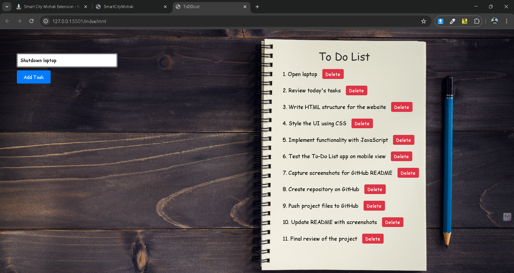
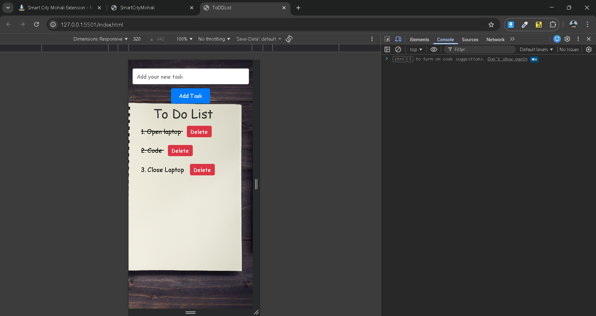

📝 To-Do List Web App

A clean, modern, and fully responsive To-Do List application built using HTML, CSS, and JavaScript.
This project is part of my MERN development journey, designed to help me practice and master JavaScript after gaining strong fundamentals in HTML and CSS.

🚀 Project Purpose

This project is created to strengthen my understanding of JavaScript essentials through real-world implementation.

Key concepts practiced:

DOM selection & manipulation

Event handling

Working with forms

Conditional rendering

Array methods (find, push, splice, forEach)

Template strings

Live UI messaging

Responsive design principles

This app helps build the logic needed before moving deeper into React and full MERN stack development.

🎨 Updated UI Highlights
✔ Fresh Modern UI

The app now features a clean interface with:

Full-screen background image

Centered input form

Soft rounded edges

Clean typography

Color-coded notifications

✔ Task List Panel

Scrollable task list

Transparent background styling

Click-to-toggle task completion

Delete button with confirmation

Auto-updating list

✔ Smooth Error & Success Messages

The UI shows real-time messages such as:

Empty input warning

Duplicate task warning

Task added

Task deleted

Messages fade automatically after a short duration.

✔ Fully Mobile Responsive

Completely redesigned for smooth experience on:

Mobile phones 📱

Tablets 📲

Laptops 💻

Desktops 🖥️

Using a dedicated media.css file and flexible layout adjustments.

✨ Features

Add new tasks

Prevent duplicate entries

Mark tasks as completed

Delete tasks with confirmation

Live UI notifications

Automatically updated list

Clean & responsive UI

🛠️ Tech Stack

HTML5 – Structure

CSS3 – Styling & responsive design

JavaScript (Vanilla JS) – Logic & DOM manipulation

Font Awesome – Icons

📂 Project Structure
📁 ToDoList
│
├── index.html
│
├── css/
│   ├── style.css
│   └── media.css
│
├── js/
│   └── app.js
│
└── Images/
    └── background.jpg

📸 Screenshots

(Add your images using drag & drop in GitHub)

🔮 Future Improvements

Add LocalStorage (persistent tasks)

Add edit/update task option

Add dark/light theme toggle

Add animations and transitions

Convert to a React version later

📚 Learning Outcome

This project strengthened my ability to:

Think in JavaScript

Build real-world functionality

Manipulate the DOM

Organize UI components

Make responsive layouts

Build clean and reusable code patterns

A solid step forward in my MERN stack journey.
